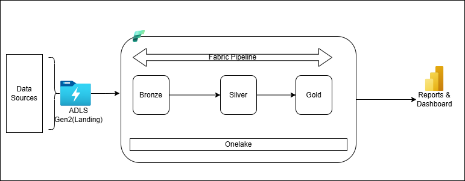
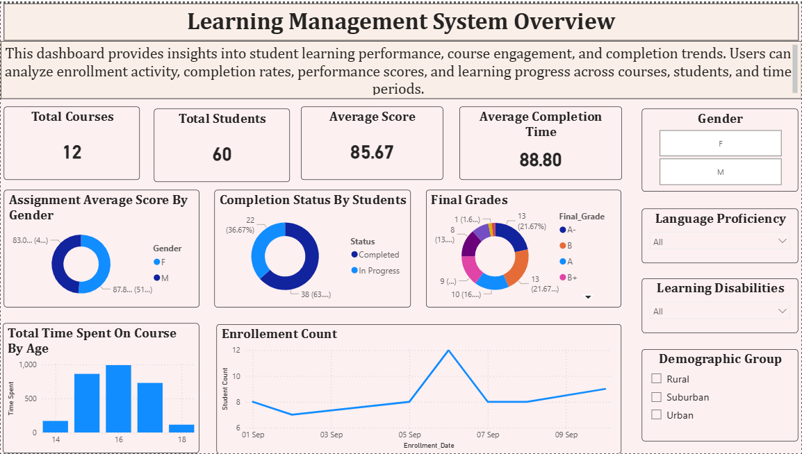

# 📂 LMS-Fabric-Data-Pipeline
**End-to-End Data Engineering Project: Learning Management System (LMS).**

## 📖 Project Overview
This project implements a scalable data solution for an Online Learning Platform (similar to Udemy). The goal is to ingest, transform, and model student engagement data to provide insights into academic performance, course completion rates, and student behavior.

The pipeline processes a high-dimensional dataset (31+ columns) containing student demographics, enrollment statuses, quiz scores, and behavioral metrics like time spent and parental involvement.

The pipeline follows a data-driven approach, moving from external raw storage to a refined semantic model in Power BI.

### Architecture


### The Landing Zone (Pre-Ingestion)
- Source: Simulated LMS website data (Student behavior, assignments, etc.).

- Storage: Azure Data Lake Storage (ADLS) Gen2.

- Pattern: Incremental Loading. In a real-world scenario, APIs would push data here. For this project, a raw container simulates this incremental flow.

### The Fabric Medallion Layers
- Bronze Layer (Raw Tables): * Data is ingested from ADLS Gen2 into Fabric Lakehouse tables.

- Format: Delta Parquet (compressed and optimized).

- State: Raw, uncleaned data.

### Silver Layer (Cleansed/Validated):

- Processing: Fabric Spark Notebooks (PySpark) perform data cleaning and business logic.

- Tasks: Handling nulls, deduplication, and normalizing the 31+ columns.

### Gold Layer (Curated/Refined):

- Structure: Fact and Dimension tables (Star Schema).

- Decision: A Lakehouse is used here (instead of a Warehouse) to allow Data Scientists to easily access the files for machine learning while still supporting SQL for reporting. It totally depends on your end usecase if you want data warehouse or lakehouse.

### Consumption & Orchestration
- Semantic Model: The Gold tables are linked to a Power BI Semantic Model using DirectLake mode (ensuring no data latency).

- Orchestration: The entire flow is unified and automated using Fabric Data Factory Pipelines.

## Folder Structure
```
├── data/               # Simulated(dummy) data for this project
├── setup/              # Resource setup documentation
├── notebooks/          # PySpark notebooks for Ingestion & Transformation layers
├── pipelines/          # Fabric resource(Similar to ADF) to orchestrate pipeline movement.
└── README.md           # Project documentation
```

## Example observations from dataset
    1. ~64% students completed courses
    2. 25 active students across 10 courses
    3. Average completion time ≈ 88 days
    4. Average performance score ≈ 85
    5. Total Courses = 12
    6. Total Enrolled Students = 60
    7. Students from urban area more enrolled in courses.



## Tech Stack
| Project Step | Technology Used | Why It Matters? |
| :--- | :--- | :--- |
| **Landing Zone** | Azure Data Lake (ADLS) Gen2 | Demonstrates the ability to manage external Azure storage and simulate real-world hybrid-cloud data sources. |
| **Ingestion** | Fabric Data Factory Pipelines | Proves expertise in building automated, scheduled, and data-driven orchestration workflows. |
| **Cleaning** | Fabric Spark Notebooks (PySpark) | Showcases high-level proficiency in distributed computing and complex data transformation logic. |
| **Modeling** | Star Schema (Fact & Dimension Tables) | Validates fundamental data warehousing knowledge and the ability to convert flat files (31+ columns) into optimized relational models. |
| **Reporting** | DirectLake / Power BI | Highlights mastery of Fabric’s unique "no-refresh" data consumption, providing real-time insights with zero latency. |