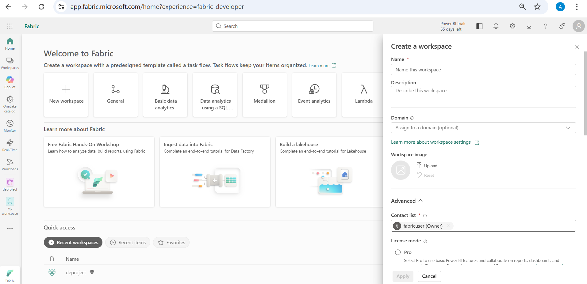
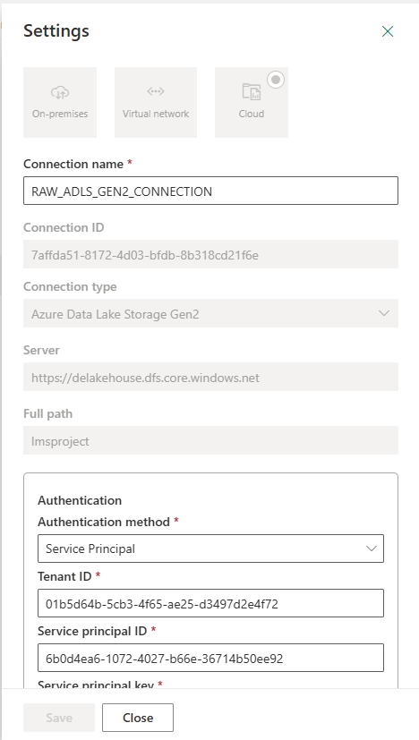
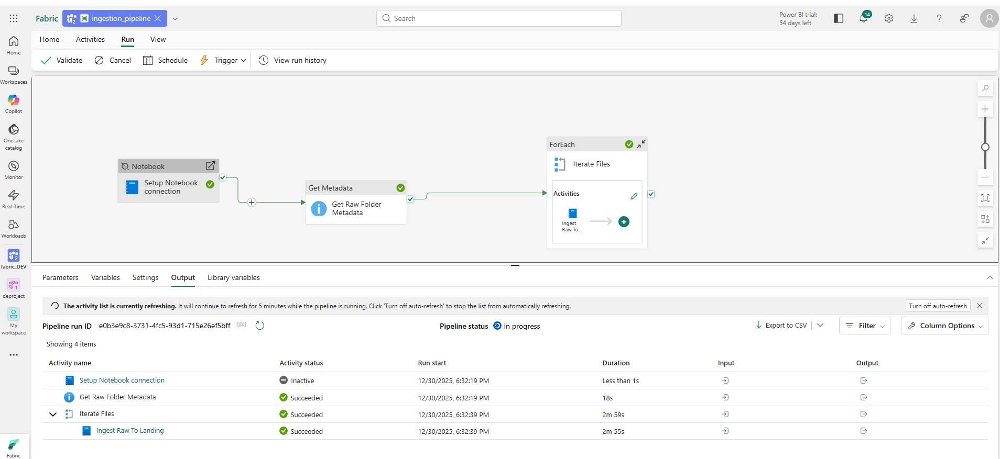
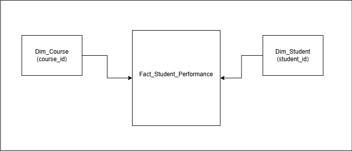
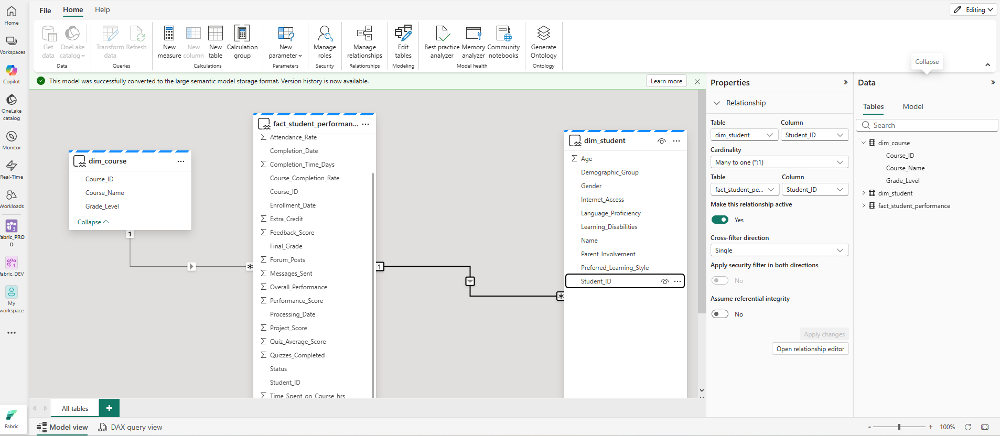
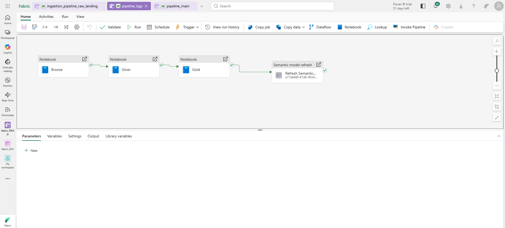
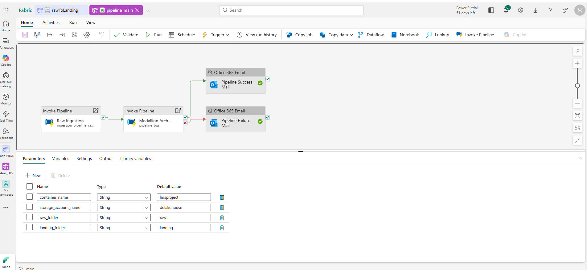
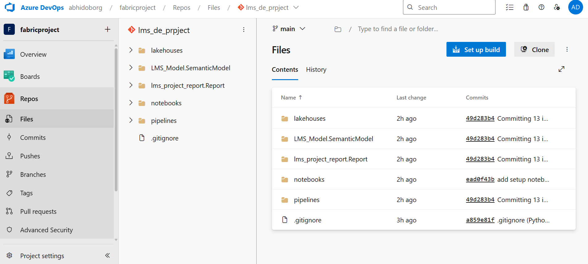
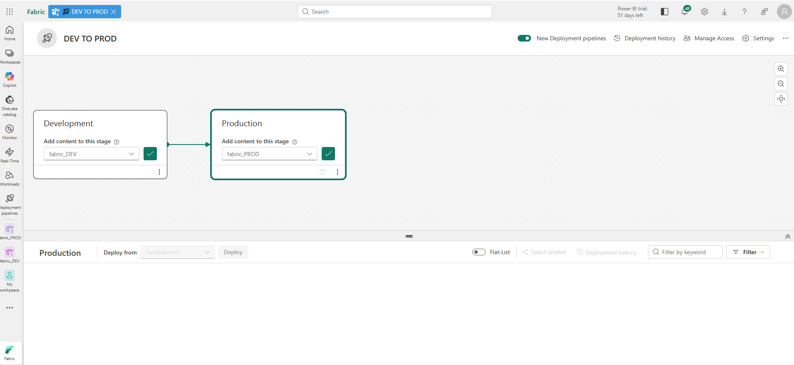
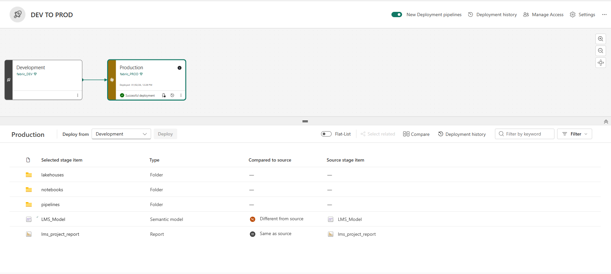

### 1. Create Fabric Workspace
- Go to your fabric app
- Inside the app, click on workspaces -> new workspace

- Give a name to your workspace. For licence mode choose trial if available or choose fabric capacity. Leave everything as it is.

### 2. Ingestion And Transformation

*Note*: Each layer will have its own seperate lakehouse.

- **Raw to landing layer**

    Data comes to raw layer to landing zone in _LMS_YYYY_MM_DD.csv_ format. 1 file/day is generated and file is needed to be written to landing zone. Data is also need to partitioned based on processing date(today). Processing_Date column will be used for partioning the data.

    Go to your azure account, and create a container and 2 folders inside it(raw and landing). Data will be loaded inside the raw folder(where we are simulating that data is generating on daily basis) and then incrementally loaded to landing folder. All things will happen using fabric notebook.

    Inside your fabric workspace, click on new item and select the notebook and name it rawToLanding.

    Connect your fabric workspace with ADLS gen2

        1. Create new resource key vault in azure which will be used to store secrets which will further used for connecting with storage container.
        2. Make sure to give role Key Vault Secrets Officer to create secrets.
        3. In azure, go to entra id -> app regestration to create a service principal.
        4. Inside the service principal you've created, create a new client secret. Note down this value, app id, and tenant id.
        5. Put this value in key vault secrets, which will be used in notebooks to access this value securely.
        6. In your storage account access permission give this service principal Storage blob data contributor role to read data from container.
    
    Data will be incrementally ingested from raw to landing based on processing_date.

    Incremental ingestion pattern types:

        a. Timestamp based: fetch records which are greater than max. timestamp from last ingestion
        b. CDC: capturing the changes of events(insert,update or delete in source system), use database logs or triggers to track changes.
        c. delta ingestion: use some reference columns(PK) to track changes on this specific column, use upsert logic here to ingest data.
        d. batch window: ingest data based on interval time(defined time period window). e.g: start and end time.
        e. partition based: refer to partiton to get the data. partition can be date or some specific column used for partition(region,country,etc).

    **Incremental Ingestion Goals**

        a. Create an automated, data-driven ingestion pipeline that:
        b. Detects latest file in ADLS Raw folder
        c. Passes file metadata to a notebook
        d. Processes & writes data to Landing zone
        e. Supports daily incremental ingestion

    Steps done in this task:

        a. Will be using the same SP created earlier for authentication.
        b. Go to Manage Connections & Gateways
        c. Create New Connection
        d. Connection type → Azure Data Lake Gen2
        e. Provide Storage account DFS endpoint: https://<account>.dfs.core.windows.net
        f. Container name in Full path
        g. Authentication → Service Principal
        h. Authenticate user identity
        i. Connection created → Raw ADLS Project

    

    How to Enable High Concurrency Mode(This will help in notebooks to share same session):

        1. Go to Workspace Settings
        2. Navigate to Data Engineering/Science > Spark Compute > High Concurrency
        3. Enable "For pipeline running multiple notebooks"
        4. Save changes

    *Note:*you can use this method to run mulitple notebooks with same session, but due to capacity issue i wiil be running each notebook seperately and will connect to notebook using entra id RBAC. I've disabled the setup notebook.

    **Create Data Pipeline**

        1. Add Get Metadata activity(Fetch list of files inside folder)
        2. Purpose: Identify today’s file in RAW folder & Read file metadata dynamically
        3. Configure:
            a. Source connection → Raw ADLS Project
            b. Directory → raw
            c. File type → Delimited text
            d. Field list → childItems (all the items under this folder)
            e. Filter file using modified data: start_date startOfDay(utcNow()) and end_date utcNow(). This will give only the files whose modified date falls within today's date range.
        4. Iterate files using foreach
        5. Purpose: iterate files (one per day)
        6. Give each notebook the same session tag(go to advance section in notebook activity).
            Pipeline 1:
            ├─ Notebook A (Session Tag: "etl_group_1")
            ├─ Notebook B (Session Tag: "etl_group_1")




- **Landing to Bronze layer**
    
    Goal is to move the partitioned files from landing zone to bronze layer(store the result in delta format table). Will be using fabric notebook to ingest data from landing zone based on the current date (in incremental logic). Need to handle repeating data coming from partition (suppose a student enroll in course today but enroll agained in another course or updated its information it will be duplicate record). 

    Use UPSERT logic to handle deduplication. Will match with student_id and course_id columns here. Each student will be enrolled in one course with the student id and each course will be having different course id.

        1. Create a lakehouse to store data in bronze layer.
        2. Open the notebook which will be used for writing data to bronze layer and connect lakehouse with it. Add data item -> existing/new lakehouse -> connect.


- **Bronze layer to Silver Layer**

    This stage focuses on refining the curated data from the Bronze layer and loading it into the Silver layer with business-ready structure and quality checks.

        1. The objectives of this phase are:
        2. Clean and validate incoming data
        3. Apply standardized transformations
        4. Maintain referential & logical consistency
        5. Support incremental ingestion using Upsert / Merge logic

- **Silver layer to Gold Layer**

    The Gold layer represents the final curated data model used for:

        1. business reporting
        2. analytics consumption
        3. Power BI dashboards
        4. semantic modeling
    
    Data in the Gold layer is derived from the cleaned & transformed Silver tables.
    Only data belonging to the current processing date is ingested (incremental load).

    **Gold Load Strategy**

    Gold tables are populated using a Fabric Notebook that:

    1. Reads data from the Silver table
    2. Filters data for today’s processing date (for example 2025-09-17)
    3️. Loads only those records into the Gold layer

    This ensures:

        ✔ incremental processing
        ✔ predictable daily refresh
        ✔ optimized reporting dataset

    🟦 Why Data Modeling is Required

        The Silver table contains consolidated data in a single structure.
        However — Gold layer is meant for:
            business reporting
            analytics & KPIs
            star schema based modeling

    So instead of maintaining one large table, the data must be:

        ✔ logically organized
        ✔ optimized for joins & aggregations
        ✔ split into Facts & Dimensions

    This improves:

        data usability
        relational design
        query performance
        semantic meaning

    **Data Modeling Approach — Star Schema**

    For this project, we adopt a Star Schema design consisting of:

        1. Fact Table
        2. Multiple Dimension Tables

    This model is commonly used in:

        1. analytics workloads
        2. BI reporting
        3. dimensional warehouses

    Real-world projects may have multiple Gold models — but this project implements one representative star schema.

For this project, the student table will be splitted into 2 dimension table(dim_student and dim_course) and 1 fact table(fact_student_performance).

    Fact_Student_Performance.student_id  ➜  Dim_Student.student_id
                Many ➜ One

    Fact_Student_Performance.course_id  ➜  Dim_Course.course_id
                Many ➜ One




**Creating End-to-End Pipeline**

### 3. Data Modelling & Report

This stage focuses on creating the semantic data model on top of the Gold Lakehouse tables and using it to build a Power BI report for business consumption.

The objective is to:

   1. Model the Gold layer tables into a star-schema
   2. Create a Power BI Semantic Model in Fabric
   3. Define relationships between Fact & Dimension tables
   4. Build & publish a Power BI report connected to the model

- **Creating the Semantic Model in Fabric**

    Navigate to the Gold Lakehouse (lms_LH_Gold) and switch to:

        1. Create a new Semantic Model:
            Name: LMS_Model
            Select the following tables: fact_student_performance,dim_student,dim_course
        2.Confirm to create the model.


This semantic model will be used as the reporting layer for Power BI.

- **🔗 Data Modeling — Star Schema Design**

    Open the semantic model in the Fabric model view and define relationships:

```Fact Table```
    
|Table|	Description|
|-----|------------|
|fact_student_performance|Core metrics (enrollment, completion, duration, performance score, etc.)|
    
```Dimension Tables```

|Table|	Key	Description|
|-----|------------|
|dim_student|	Student_ID,Demographic & profile attributes|
|dim_course|	Course_ID,Course attributes & metadata|


```Relationships Configured```
1. fact_student_performance.Student_ID → dim_student.Student_ID(Many-to-One)
2. fact_student_performance.Course_ID → dim_course.Course_ID(Many-to-One)

*Note*:
Many side always remains on the Fact table,
One side remains on the Dimension tables.



This results in a Star Schema optimal for BI consumption.

- **🖥️ Connecting Power BI Desktop to the Semantic Model**

    1. Open Power BI Desktop and:
        Create a Blank Report
        Go to:
        OneLake Data Hub → Power BI Semantic Models
    2. Select:
        LMS_Model


- **Connect using DirectQuery**

Switch to Model View to verify relationships.

    1. Refresh to sync latest metadata.

- **📈 Building the Power BI Report**

    1. The report was built using the fields from:
        Fact table, Student dimension, Course dimension

    2. Sample Insights Created:
        Total students enrolled
        Total courses
        Course completion metrics
        Average completion time
        Performance score trends
        Course completion status %
        Total learning time by age group

- **💾 Publishing the Report to Fabric Workspace**
    
    1. Save report as: LMS_Report.pbix
    2. Publish to workspace: Fabric_DEV workspace
    3. Report becomes available in Fabric UI
    4. The uploaded report is now connected to: Gold Lakehouse tables & LMS semantic model

*The PBIX file can be reused by replacing data connections.*

- **Outcome**

    By the end of this stage:

        ✔ Gold tables were modeled into a star-schema
        ✔ A semantic layer was created in Fabric
        ✔ Fact & dimension relationships were defined
        ✔ A Power BI report was built & published
        ✔ Business users can consume curated insights

    *This completes the Landing → Bronze → Silver → Gold → Reporting pipeline.*




#### 4. Git integration and CI/CD in Fabric

Git integration in Microsoft Fabric is a powerful capability that enables seamless collaboration, version control, and change management across data engineering projects. By connecting Fabric workspaces with Git repositories, teams can track changes, maintain project history, and support structured development workflows.

This integration helps teams work more efficiently by:
        
        1. Managing version-controlled notebooks, pipelines, datasets, and lakehouse assets
        2. Enabling collaboration across multiple developers
        3. Supporting code review and controlled deployments
        4. Reducing risk of accidental changes in production environments





- **Current Pipline Scenario**

    In the development workspace, the pipeline currently follows this flow:

    1. Source data is read from the raw folder in Azure Data Lake Gen2
    2. A notebook processes the file
    3. The notebook is triggered via a Fabric data pipeline
    4. Output is written to the landing folder
    5. Subsequent notebooks and pipelines move the data:
    6. Landing ➜ Bronze
    7. Bronze ➜ Silver
    8. Silver ➜ Gold


    *All operations today run within the Dev environment, and everything functions correctly for development and testing.*

- **Why Changes Are Needed for CI/CD**

Once CI/CD and Git integration are enabled, the same assets will be deployed to multiple environments (Dev → Test → Prod).
However — the current pipelines reference hard-coded Dev data sources.

In real-world projects:

    Production pipelines must not read/write from Dev storage
    Each environment should connect to its own datasets / storage paths
    Deployments should not require manual code edits

Therefore, our pipelines must support environment-based configuration.To achieve this, data source references must be:

    Parameterized
    Dynamic
    Swappable per environment

so that Prod pipelines automatically point to Prod storage.

- **🗂 Creating Production Data Source Structure (Simulation)**

To simulate a real-world multi-environment setup, a new container was created in Azure Data Lake:

    fabric-prod
    ├── raw
    └── landing


In an enterprise setup, Dev and Prod would typically use separate storage accounts, but for simplicity this project simulates isolation using a dedicated Prod container.

This new container represents:

    Prod Raw Zone
    Prod Landing Zone
    These locations will be configured as dynamic parameters inside notebooks and pipelines.

This allows:

    Dev deployments → point to Dev data containers
    Prod deployments → automatically switch to Prod containers without modifying code.

- **Creating Azure DevOps Account**

This section describes the initial Azure DevOps setup required to enable Git integration and CI/CD for the Microsoft Fabric project.

The goal of this step is to:

    create an Azure DevOps organization
    create a DevOps project
    create a Git repository where Fabric workspace artifacts will be version-controlled

✅ Step 1 — Create Azure DevOps Account

    1. Navigate to: https://dev.azure.com
    2. Select Start Free and sign in with your Microsoft account.
    3. If prompted:choose your region & complete initial onboarding

This creates your Azure DevOps organization

✅ Step 2 — Create a New DevOps Project

From the DevOps home screen:

    1. Click New Project
    2. Enter project name: fabric-lms-end-to-end


Set project visibility to:

    1. Private
    2. Click Create Project. A new DevOps project is now created under your organization.

✅ Step 3 — Create a Git Repository for Fabric Workspace

Inside the created project:

    1. Go to Repos: A default repo with the same project name is created automatically
    2. Create a new repo instead: Repository name:fabric-lms-project
    3. Leave default branch as: main
    4. Click Create

This repository will be used for:

    1. storing notebooks
    2. pipelines
    3. semantic model definitions
    4. lakehouse artifacts
    5. configuration files



